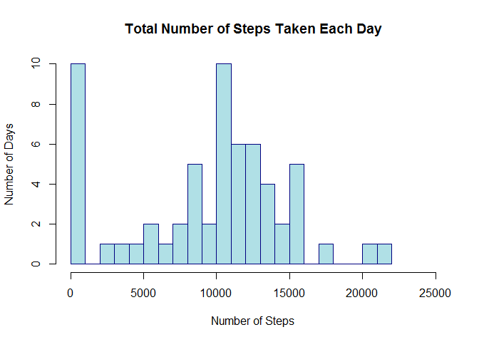
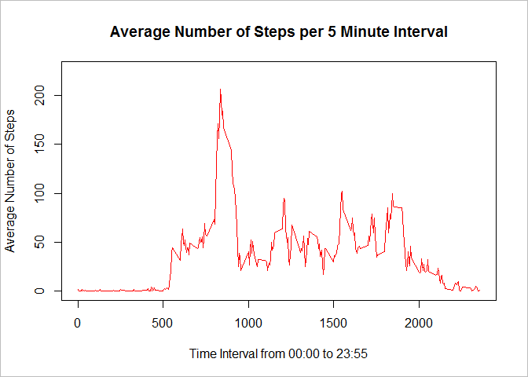
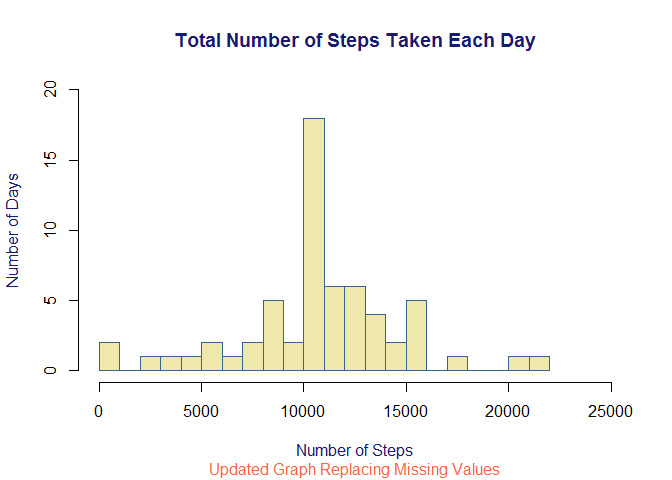
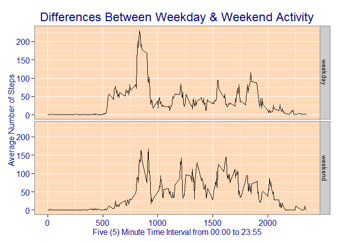

# Reproducible Research: Peer Assessment 1
kekell  
Sunday, August 16, 2015  

This is an R Markdown document for Peer Assessment 1 from the Coursera Reproducible Research Course. 

***

### LOADING AND PROCESSING DATA

#### Clear Environment Variables


```r
rm(list = ls())
```

#### Call Required Libraries & Set Working Variables


```r
require(ggplot2)
```

```
## Loading required package: ggplot2
```

```r
dataURL         <- "https://d396qusza40orc.cloudfront.net/repdata%2Fdata%2Factivity.zip"
zipFile         <- "repdata_data_activity.zip"
baseDir         <- getwd()
dataDir         <- paste(baseDir, "Activity_Monitoring", sep="/")
zipFileLoc      <- paste(dataDir, zipFile, sep="/")
activityFile    <- "activity.csv"
activityFileLoc <- paste(dataDir, activityFile, sep = "/" )
```

#### Check if working directory, zip file(s), and working file(s) exist.    


```r
if(!dir.exists(dataDir)) {
        cat("Directory: ", dataDir, " does not exist in the working directory.")
        dir.create(dataDir,showWarnings = FASLE)
        cat("Created the specified working directory.")        
} else {
        cat("Directory: ", dataDir, " exists in the working directory.")
}
```

```
## Directory:  C:/Users/Kevin/Desktop/Coursera Working Dir/Activity_Monitoring/Activity_Monitoring  exists in the working directory.
```

```r
## Check to see if *.zip file exists, if notdownload the *.zip file.
if (!file.exists(zipFileLoc)) { 
        cat("File: ", zipFile, " does not exist. Downloading and unzipping file.")
        download.file(url=dataURL,destfile=zipFileLoc)
} else  {
        cat("File: 'repdata_data_activity.zip' exists in the working directory.")
}
```

```
## File: 'repdata_data_activity.zip' exists in the working directory.
```

```r
## Check to see if the uncompressed file exists in the project directory.
if (!file.exists(activityFileLoc)) {
        cat("File: ", activityFile," does not exist. Unzipping file to working directory.")
        unzip(zipFileLoc, exdir = dataDir, overwrite = TRUE)
} else  {
        cat("File: ", activityFile, " exists in the working directory.")
}
```

```
## File:  activity.csv  exists in the working directory.
```

#### Load CSV File for Analysis and Processing.


```r
activityData <- read.csv(file = activityFileLoc, header = TRUE, sep =",", quote = "\"", na.strings = "NA")
```

***

### WHAT IS MEAN TOTAL NUMBER OF STEPS TAKEN PER DAY?

#### Aggregate or sum the total number of steps taken each day.


```r
aggSteps <- aggregate(activityData$steps, by = list(activityData$date), FUN = sum, na.rm = TRUE)
```

#### Plot a histogram of the Total Number of Steps Taken each Day.


```r
hist(aggSteps$x, 
     col = "powderblue",
     border = "navyblue",
     main = "Total Number of Steps Taken Each Day",
     xlab = "Number of Steps", ylab = "Number of Days",
     xlim = c(0,25000), breaks = 30)
```

 


Calculate the mean and median of the total number of steps taken each day.


```r
meanAggSteps   <- mean(aggSteps$x)
medianAggSteps <- median(aggSteps$x)
```

The mean total number of steps taken each day   = 9354.23  
The median total number of steps taken each day = 10395.00    

***

### WHAT IS THE AVERAGE DAILY ACTIVITY PATTERN?

#### Average Number of Steps by Day per Five (5) Minute Interval


```r
avgStepsbyInterval <- aggregate(steps ~ interval, activityData, mean)
```

#### Plot the Average Number Steps by Day per Five (5) Minute Interval


```r
plot(avgStepsbyInterval$interval,avgStepsbyInterval$steps, 
     main="Average Number of Steps per 5 Minute Interval", col = "red",
     type="l", xlab="Time Interval from 00:00 to 23:55", ylab="Average Number of Steps", 
     xlim=c(0,2359), ylim=c(0,225))
     box("figure", col="grey")
```

 

#### Determine the five (5) minute time interval that contained the maximum number of steps.


```r
max_interval <- avgStepsbyInterval[which.max(avgStepsbyInterval$steps),1]
```

The five (5) minute time interval containing the maximum number of steps occurred at: 835 

***

### INPUTTING MISSING VALUES

#### Calculate and report the number of days/intervals where there were the missing values = NA.


```r
numNAs <- sum(is.na(activityData))
```

The number of data records with missing values or 'NA' = ", 2304   

#### Replace each missing value with the mean value of its 5-minute interval   


```r
popMean <- function(steps, interval) {
        populate <- NA
        if (!is.na(steps)) 
                populate <- c(steps) else populate <- (avgStepsbyInterval[avgStepsbyInterval$interval == interval, "steps"])
                return(populate)
}

EditActivityData <- activityData
EditActivityData$steps <- mapply(popMean, EditActivityData$steps, EditActivityData$interval)

popAggSteps <- tapply(EditActivityData$steps, EditActivityData$date, FUN = sum)
```

#### Plot histogram of the Total Number of Steps Taken Each Day    


```r
hist(popAggSteps, 
     col = "palegoldenrod",
     border = "steelblue4",
     main = "Total Number of Steps Taken Each Day", col.main = "midnightblue",
     sub = "Updated Graph Replacing Missing Values", col.sub = "tomato",
     xlab = "Number of Steps", ylab = "Number of Days", col.lab = "midnightblue",
     ylim = c(0,20), xlim = c(0, 25000),
     breaks = 30)
```

 

#### Calulate the mean and median of the total number of steps taken each day.    


```r
MeanPopAggSteps   <- mean(popAggSteps)
MedianPopAggSteps <- median(popAggSteps)
```

The mean total number of steps taken each day = 10766.2   
The median total number of steps taken each day = 10766.2      


***

### ARE THERE DIFFERENCES IN ACTIVITY PATTERNS BETWEEN WEEKDAYS AND WEEKENDS?

#### Create a new factor variable in the dataset with two (2) levels: weekday & weekend.


```r
EditActivityData$dateType <-  ifelse(as.POSIXlt(EditActivityData$date)$wday 
        %in% c(0,6), 'weekend', 'weekday')
averagedActivityDataImputed <- aggregate(steps ~ interval + dateType, data=EditActivityData, mean)
```

#### Create a panel plot containing a time series plot of the five (5) minute interval (x-axis)
#### and the average number of steps taken, averaged across all weekday & weekend days.  


```r
ActivityDiff <- ggplot(averagedActivityDataImputed, aes(interval, steps, fill=dateType)) +
        geom_line() +
        facet_grid(dateType ~ .) +
        guides(fill=FALSE) + theme_bw() +
        theme(panel.background = element_rect(fill = "peachpuff"),
              panel.grid.major = element_line(linetype = "solid", color = "white"),
              panel.grid.minor = element_line(linetype = "dashed", color = "white"),
              plot.title = element_text(size = rel(1.5), color = "dark blue"),
              axis.title.y = element_text(size = rel(1.0), color = "dark blue", angle = 90),
              axis.title.x = element_text(size = rel(1.0), color = "dark blue"),
              axis.text = element_text(size = rel(1.0), color = "dark blue")) +    
        labs(x="Five (5) Minute Time Interval from 00:00 to 23:55", y="Average Number of Steps") + 
        labs(title=expression("Differences Between Weekday & Weekend Activity"))
print(ActivityDiff)
```

 
***
